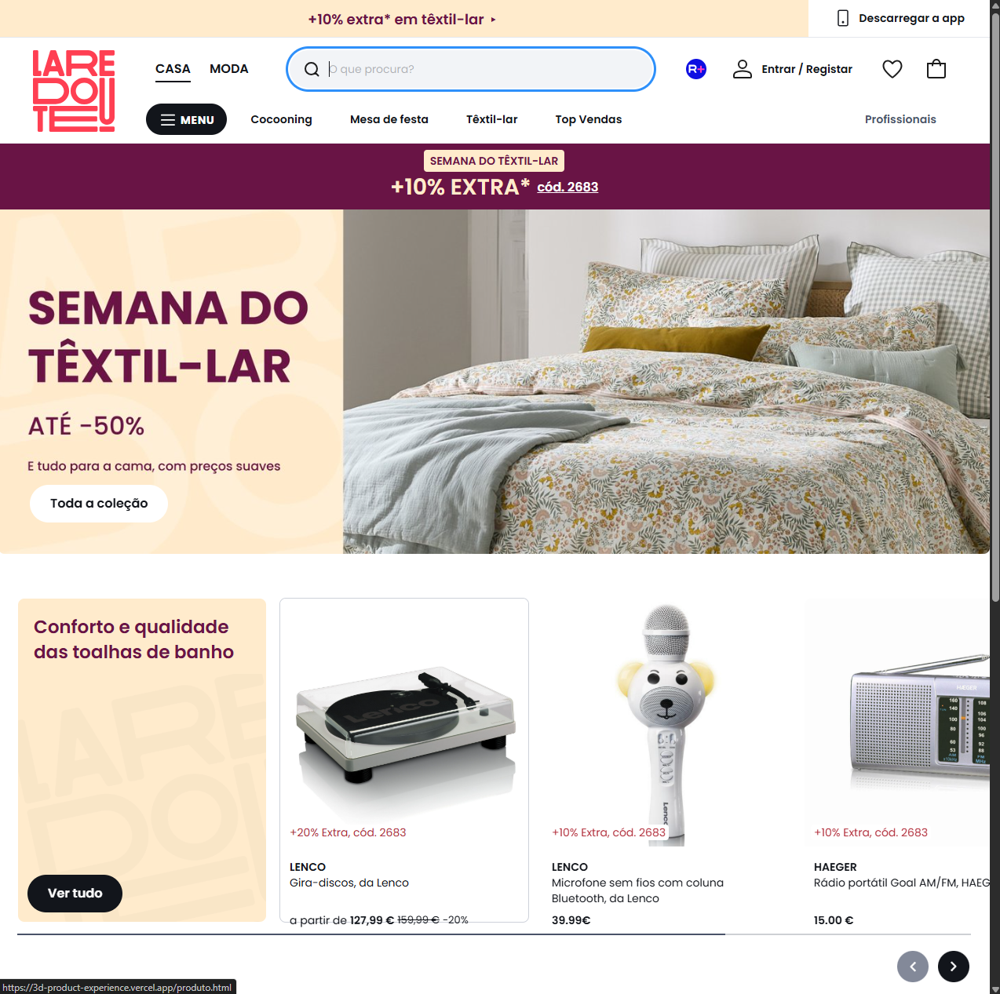
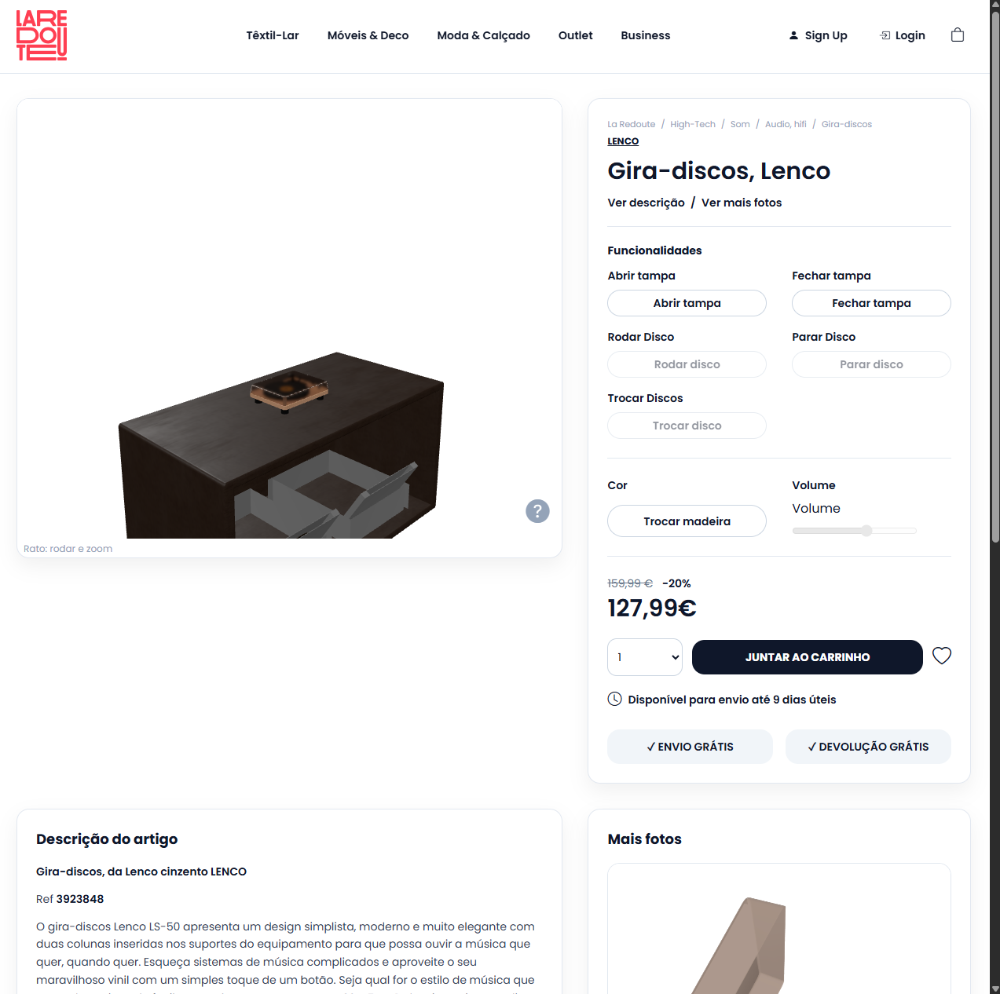
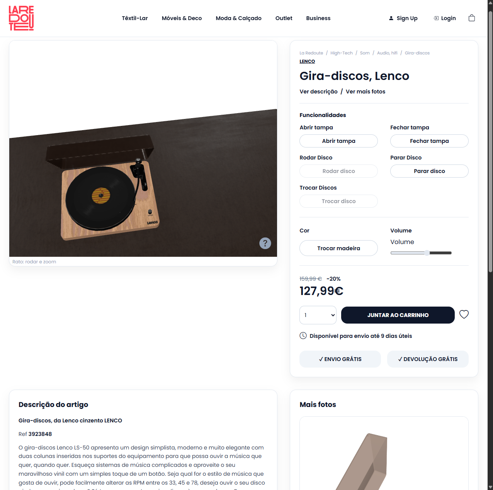
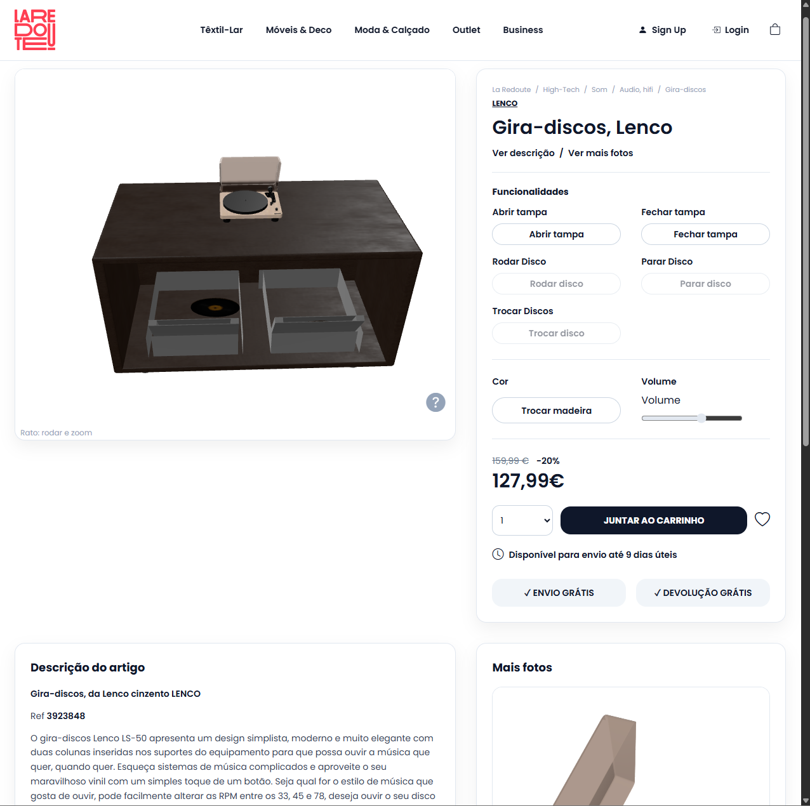

# 3D Product Experience

Interactive 3D e-commerce experience inspired by a La Redoute product page, featuring real-time product customization, audio interaction, and immersive 3D visualization.

---

## Overview

This project was developed as part of an academic initiative focused on interactive web experiences and 3D product visualization.

The application recreates a modern e-commerce product page with a fully interactive 3D turntable model created in Blender and integrated into a web environment.

Users can interact with the product in real time through multiple visual and audio customizations.

---

## Features

- Interactive 3D turntable model
- Dynamic vinyl switching
- Real-time audio changes
- Product color customization
- Rotating vinyl animation
- Interactive lid opening system
- Responsive web interface
- Real-time visual interactions

---

## Tech Stack

- HTML5
- CSS3
- JavaScript
- Three.js
- Blender

---

## 3D Modeling

The turntable model was created and configured in Blender before being exported and integrated into the web application.

---

## Project Goal

The main goal of this project was to recreate a modern interactive e-commerce experience using 3D visualization and dynamic frontend interactions.

---

## Preview

Interactive product visualization with real-time customization and audio interaction.

## Screenshots

### Homepage

### Produto 3D

### Interação 3D

### Controlos do Produto

---

## Future Improvements

- Mobile optimization
- Additional product customizations
- Improved animations
- Enhanced UI transitions

---

## Author

André Costa

- GitHub: https://github.com/costandre01
- LinkedIn: https://linkedin.com/in/andre-costa-/
